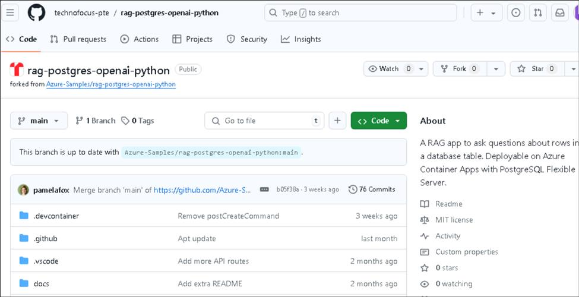
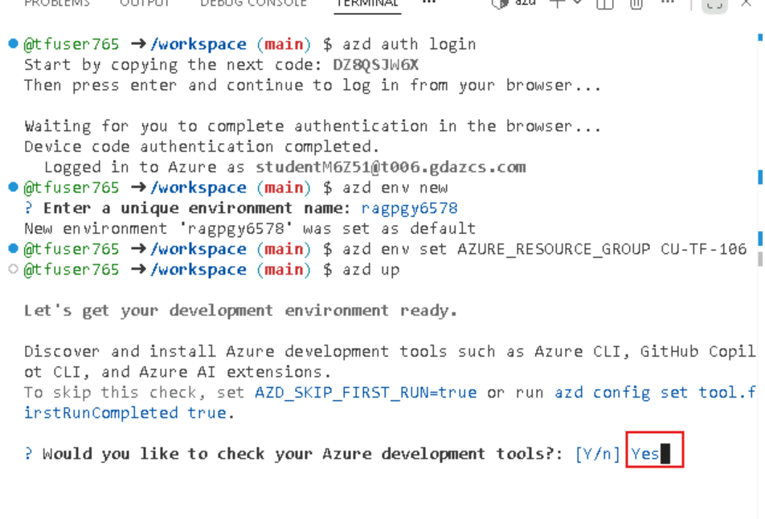
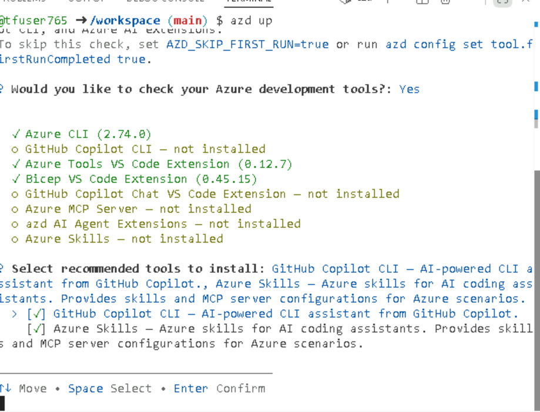
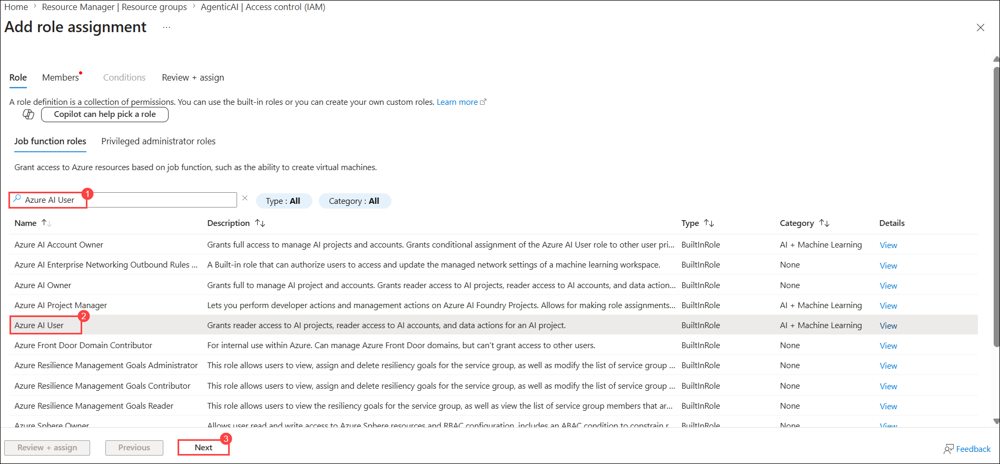

# Usecase 03 - Deploying and Testing a Custom Chat Application with PostgreSQL

**Objective:**

- To configure the development environment on Windows by installing
  Azure CLI, Node.js, assigning Azure subscription roles, starting
  Docker Desktop, and enabling Visual Studio Code with Dev Containers
  extension.

- To deploy and test Custom Chat Application with PostgreSQL and OpenAI
  on Azure.

In this use case, you will set up a comprehensive development
environment, deploy a chat application integrated with PostgreSQL, and
verify its deployment on Azure. This involves installing essential tools
like Azure CLI, Docker, and Visual Studio Code ( we have already done it
for you on host env ), configuring user roles in Azure, deploying the
application using Azure Developer CLI, and interacting with the deployed
resources to ensure functionality.

**Key technologies used** -- Python, FastAPI, Azure OpenAI models, Azure
Database for PostgreSQL and azure-container-apps,ai-azd-templates.

**Estimated duration** -- 45 minutes

**Lab Type:** Instructor Led

**Pre-requisites:**

GitHub account -- You are expected to have your own GitHub login
credentials. If you do not have, please create one from here

- +++<https://github.com/signup?user_email=&source=form-home-signupobjectives+++>

## Exercise 1 : Provision , deploy the application and test it from the browser

### Task 0: Understand the VM and the credentials

In this task, we will identify and understand the credentials that we
will be using throughout the lab.

1.  **Guide** tab hold the lab guide with the instructions to be
    followed throughout the lab.

2.  **Resources** tab has got the credentials that will be needed for
    executing the lab.

    - **Username -**VM username

    - **Password-** VM password

**Azure credentials:**

- **Username** – The user id with which you need to login to the Azure
  services.

- **Password** – Password to the Azure login. Let us call this Username
  and password as Azure login credentials. We will use these creds
  wherever we mention Azure login credentials.

- **Generate Authentication code**

3.  Ensure that **Enhanced Mode** is enabled in the Tools section before
    proceeding with the lab tasks

> 

\[!Alert\] **Important:** Make sure you create all your resources under
this Resource group

### Task 1: Register Service provider

1.  Open a browser go to
    +++[https://portal.azure.com+++](https://portal.azure.com+++/) and
    sign in with your cloud slice account below.

Username: <+++@lab.CloudPortalCredential>(User1).Username+++

Password: <+++@lab.CloudPortalCredential>(User1).AccessToken+++

 

2.  Click on **Subscriptions** tile.

3.  Click on the subscription name.

4.  Expand Settings from the left navigation menu. Click on **Resource
    providers**, enter **+++Microsoft.AlertsManagement+++** and select
    i,t, and then click **Register**.

 

5.  Click on **Resource providers**,
    enter **+++Microsoft.DBforPostgreSQL+++** and select i,t, and then
    click **Register**.

   

6.  Repeat the steps \#10 and \#11 to register the following Resource
    providers.

    - **+++Microsoft.Search+++**

    - **+++Microsoft.Web+++**

    - **+++Microsoft.ManagedIdentity+++**

    - **+++Microsoft.Management+++**

    - **+++Microsoft.operationalinsights+++**

### Task 2: Copy the existing resource group name

1.  On Home page, click on **Resource groups** tile.

2.  Make sure you already have a resource group created for you to work.
    Never delete this resource group. Instead, you can delete resources
    within the resource group, but not the resource group itself.

3.  Click on resource group name

4.  Copy the resource group name and save it in Notepad to use for
    deploying all resources into this resource group

### Task 3 : Open development environment

1.  Open your browser, navigate to the address bar, type or paste the
    following URL: +++
    https://github.com/technofocus-pte/ragpostgres-openai.git+++

2.  Click on **fork** to fork the repo. Give unique name to the repo and
    click on **Create repo** button.

 

3.  Click on **Code -\> Codespaces -\> Codespaces+**

4.  Wait for the Codespaces environment to setup. It takes few minutes
    to setup completely

 

### Task 4: Provision Services and deploy application to Azure

1.  In the infra folder, select the main.bicep file to open it.

2.  In the Bicep file, navigate to line 157 and update the existing
    resource group name by replacing the current value ('CU-TF-106')
    with the name of your resource group.

> 

3.  Run the following command on the Terminal. It generates the code to
    copy. Copy the code and press Enter.

+++azd auth login+++

4.  Default browser opens to enter the generated code to verify. Enter
    the code and click **Next**.

5.  Sign in with your Azure credentials.

6.  To create an environment for Azure resources, run the following
    Azure Developer CLI command.

\[!Note\]: When creating an environment, ensure that the name consists
of lowercase letters.

+++azd env new+++

Enter environment
name: [+++ragpgpyXXXX](mailto:+++ragpgpy@lab.LabInstance.Id)+++

7.  Run below command to set resource group

+++azd env set AZURE_RESOURCE_GROUP
@lab.CloudResourceGroup([CU-TF-106](https://portal.azure.com/#resource/subscriptions/9596fee7-32c3-4ce3-8e9a-65461763c98f/resourceGroups/CU-TF-106)).Name+++

8.  Run the following Azure Developer CLI command to provision the Azure
    resources and deploy the code.

> +++azd up+++

9.  When prompted, select your **subscription -
    @lab.CloudSubscription.Name** to create the resources and select the
    region **North Central US**

> 
>
> 
>
> 
>
> 

10. When prompted, **enter a value for the 'openAILocation'
    infrastructure parameter** select the region **Sweden central**

11. Provisioning resource will take around 15-16 min. Click **Yes** if
    prompted.

12. Wait for the template to provision all resource successfully.

13. Click on the deployed web app endpoint link.

14. Click on **Open**. It opens new tab with app

15. The app opens.

\[!Alert\] Important: If you face any issue launching the app, please
redeploy it by following step 12, i.e azd deploy

### Task 5: Use chat app to get answers from files

1.  In the **RAG on database |OpenAI+PoastgreSQL** web app page, **click
    on Best shoe for hiking?** button and observe the output

2.  Click on the **clear chat.**

3.  In the **RAG on database |OpenAI+PoastgreSQL** web app page, click
    on **Climbing gear cheaper than \\30** button and observe the output

4.  Click on the **clear chat.**

### Task 6: Verify deployed resources in the Azure portal

1.  On Home page of Azure portal, click on **Resource Groups**.

2.  Click on your resource group name

3.  Make sure the below resource got deployed successfully

    - Container App

    - Application Insights

    - Container Apps Environment

    - Log Analytics workspace

    - Azure OpenAI

    - Azure Database for PostgreSQL flexible server

    - Container registry

### Task 7: Clean up all the resources

To clean up all the resources created by this sample:

1.  Switch back to **Azure portal -\> Resource group- \> Resource group
    name.**

2.  Select all the resource and then click on Delete as shown in below
    image. (**DO NOT DELETE** resource group)

3.  Type +++delete+++ on the text box and then click on **Delete**.

4.  Confirm the deletion by clicking on **Delete**.

5.  Switch back to Github portal tab and refresh the page.

6.  Click on Code , select the branch created for this lab and click
    on **Delete**.

7.  Confirm the branch deletion by clicking on **Delete** button.

**Summary:**:This use case walks you through deploying a chat
application with PostgreSQL and OpenAI on Azure, focusing on cloud-based
application deployment and management. you’ve set up the development
environment, installed necessary tools like Azure CLI, configured Azure
resources using Azure Developer CLI, and deployed the application to
Azure Container Apps.
