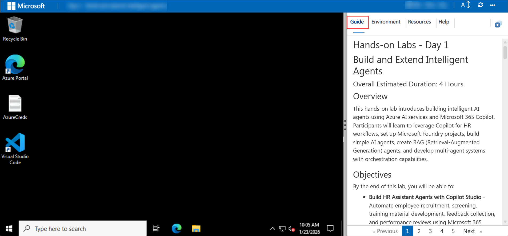
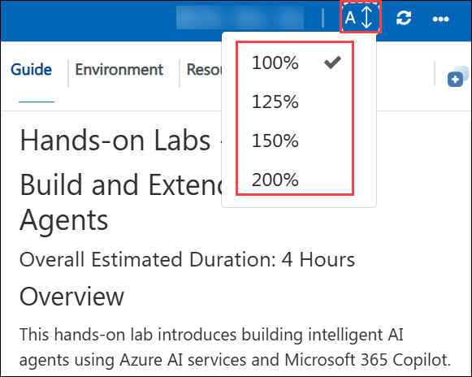
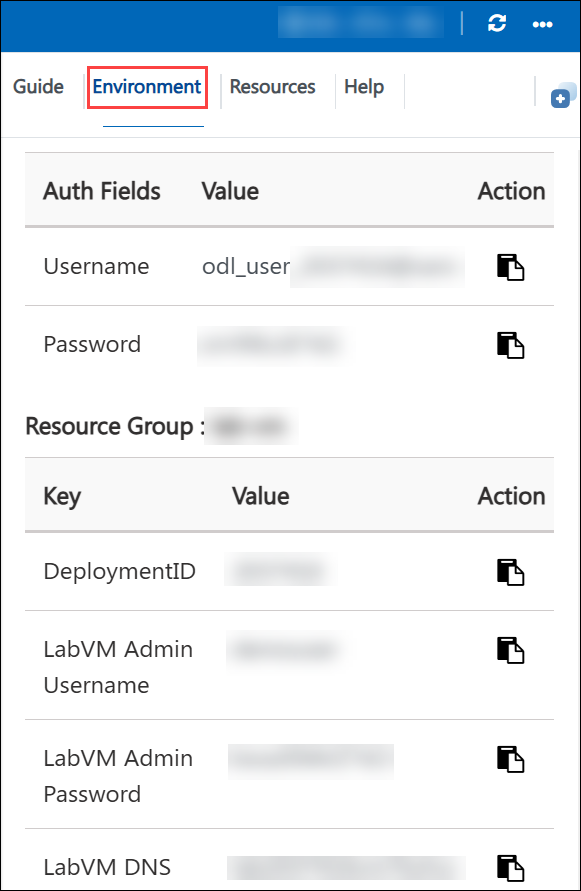
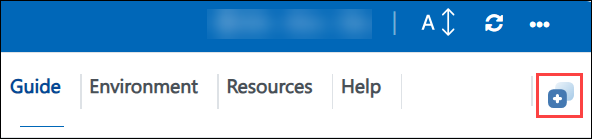
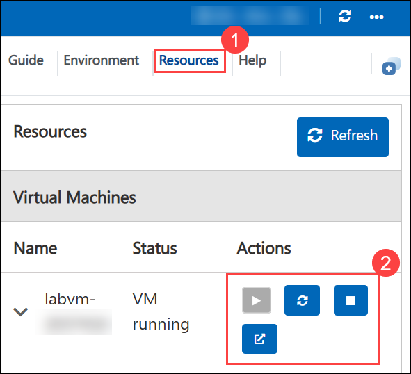
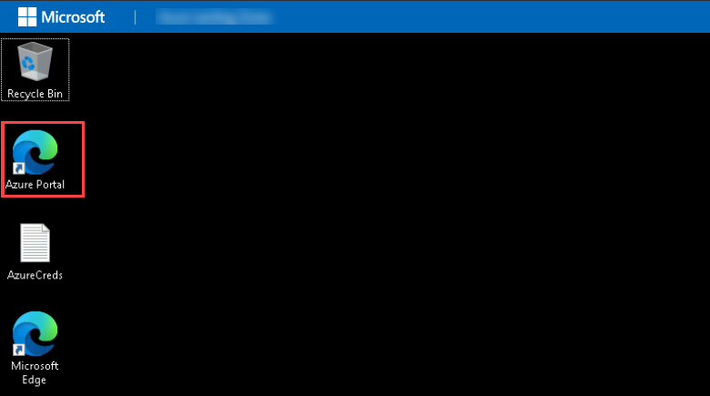
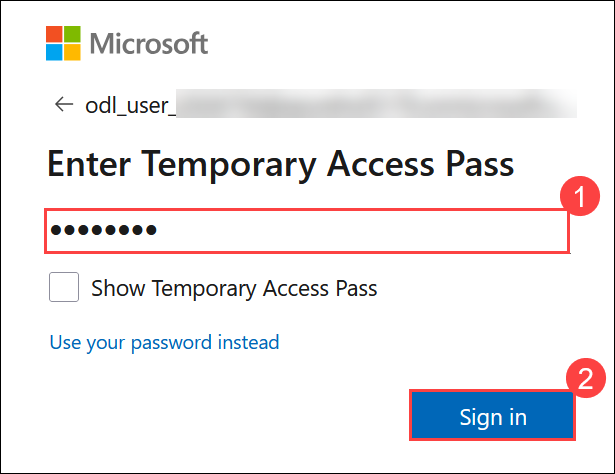
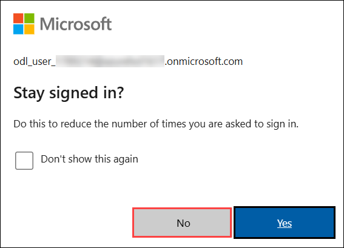

# Agentic AI and data governance on Microsoft Azure

### Overall Estimated Duration: 4 Hours

## Overview

In this hands-on lab, you will work through two connected Microsoft Foundry and Microsoft Fabric scenarios for Contoso. In **Usecase 1**, you will modernize legacy SQL code using the **Modernize Your Code Solution Accelerator**, deploying it on Azure through GitHub Codespaces and the Azure Developer CLI, then using **Microsoft Foundry agents** to translate outdated SQL dialects (such as Informix, Netezza, and Teradata) into modern, standardized SQL with minimal manual effort.

In **Usecase 2**, you will build an intelligent **customer resolution agent** for Contoso Electronics that unifies three grounding sources into a single Foundry agent: **Work IQ** (customer and internal email), **Foundry IQ** (company policy documents indexed in Azure AI Search), and **Fabric IQ** (structured business data — customers, orders, support tickets, and shipments — modeled as a Fabric Ontology and exposed through a Fabric Data Agent). By the end of the lab, this unified agent can read a customer email, validate the facts against real business data, apply Contoso's policies, and draft a professional, policy-compliant response.

## Objective

By the end of this lab, participants will be able to:

- **Provision the Modernize Your Code Solution Accelerator on Azure** using GitHub Codespaces and the Azure Developer CLI (`azd auth login`, `azd env new`, `azd up`), deploying Foundry, a Foundry project, Container Apps (frontend and backend), Cosmos DB, Key Vault, and a storage account.

- **Translate legacy SQL code with Microsoft Foundry agents** by uploading legacy query files through the accelerator's web app, observing real-time batch translation, and downloading and validating the modernized SQL output.

- **Create an Azure AI Search service and storage account** to index Contoso's policy and operational documents as a knowledge source for Foundry IQ.

- **Create a Foundry resource and agent ("IQAgent")** as the foundation for the customer resolution assistant.

- **Set up a Microsoft Fabric workspace and lakehouse**, then ingest sample business data covering customers, orders, order items, support tickets, refund claims, and shipment tracking events.

- **Build an Ontology (preview)** that defines entity types (Customer, Order, OrderItem, SupportTicket, RefundClaim, ShipmentTrackingEvent) and the relationships between them (Places, Contains, hasSupportTicket, hasTrackingEvent, mayLeadTo).

- **Create a Fabric Data Agent** grounded in that ontology so business data can be queried and validated in natural language.

- **Unify Work IQ, Foundry IQ, and the Fabric Data Agent into a single Foundry agent**, giving it instructions to analyze customer issues, validate data across systems, apply business policy, recommend resolutions, and draft professional responses.

- **Test the unified agent against demo customer emails** to see it triage real shipment and delivery issues end-to-end.

## Pre-requisites

Participants should have:

- A **GitHub account**, required to open GitHub Codespaces and run the Modernize Your Code Solution Accelerator (sign up at https://github.com/signup if you don't already have one).

- Access to the **Azure Portal** with an assigned Azure subscription and resource group.

- Access to the **Microsoft Fabric portal** (app.fabric.microsoft.com) with a Fabric capacity license (needed for the Lakehouse and Ontology (preview) item).

- Basic familiarity with running commands in a terminal (this lab uses the Azure Developer CLI, `azd`, inside GitHub Codespaces).

- Basic familiarity with legacy and modern SQL syntax is helpful, though not required, since the Foundry agents perform the translation.

- Basic familiarity with core AI agent concepts — grounding, knowledge bases, and tools — as used by Microsoft Foundry agents.

## Explanation of Components

The architecture across this lab involves the following key components:

1. **GitHub Codespaces & Azure Developer CLI (azd):** The development environment used to authenticate, provision, and deploy the Modernize Your Code Solution Accelerator to Azure with a few `azd` commands.

2. **Microsoft Foundry & Foundry project:** Hosts the AI agents used throughout the lab — the accelerator's built-in translation agents in Usecase 1, and the standalone **IQAgent** built from scratch in Usecase 2.

3. **Azure Container Apps (frontend + backend):** Runs the Modernize Your Code Solution Accelerator's web application, where legacy SQL files are uploaded, queued, translated in real time, and made available for download.

4. **Azure Cosmos DB, Key Vault, and Storage account:** Supporting services deployed alongside the accelerator for state tracking, secrets management, and file storage.

5. **Azure AI Search:** Indexes Contoso's policy and operational documents so they can be retrieved quickly and accurately as grounding knowledge for the Foundry agent.

6. **Foundry IQ knowledge base:** A Foundry-managed knowledge base built on top of the Azure AI Search resource and a Blob Storage container of policy documents, connected to the agent so it can apply Contoso's SLA, refund, and escalation policies.

7. **Microsoft Fabric workspace & IQ_Lakehouse:** Centralized storage for Contoso Electronics' structured business data — customers, orders, order items, support tickets, refund claims, and shipment tracking events.

8. **Ontology (preview) item:** Defines entity types over the lakehouse data and the relationships connecting them  turning raw tables into a business-meaningful semantic layer.

9. **Fabric Data Agent:** A natural-language interface grounded in the ontology, added to the unified Foundry agent as a tool so it can validate customer, order, inventory, and shipment facts before making a recommendation.

10. **Work IQ Mail tool:** Connects the unified Foundry agent to email/Outlook data, letting it read customer and internal emails to understand the issue and its urgency.

11. **Unified Foundry agent (IQAgent):** The customer resolution agent itself — instructed to review emails, validate facts with the Fabric Data Agent, apply policy via Foundry IQ, recommend the best next action, and draft clear, professional responses.

## Getting Started with the lab

Welcome to your Azure AI Agents Workshop, Let's begin by making the most of this experience.

## Accessing Your Lab Environment

Once you're ready to dive in, your virtual machine and **Guide** will be right at your fingertips within your web browser.

## Lab Guide Zoom In/Zoom Out

To adjust the zoom level for the environment page, click the **A↕ : 100%** icon located next to the timer in the lab environment.

## Virtual Machine & Lab Guide

Your virtual machine is your workhorse throughout the workshop. The lab guide is your roadmap to success.

## Exploring Your Lab Resources

To get a better understanding of your lab resources and credentials, navigate to the **Environment** tab.

## Utilizing the Split Window Feature

For convenience, you can open the lab guide in a separate window by selecting the **Split Window** button from the Top right corner.

## Managing Your Virtual Machine

Feel free to **Start, Stop, or Restart (2)** your virtual machine as needed from the **Resources (1)** tab. Your experience is in your hands!

## Let's Get Started with Azure Portal

1. On your virtual machine, click on the Azure Portal icon.

   

2. You'll see the **Sign into Microsoft Azure** tab. Here, enter your **credentials (1)** and select **Next (2)**:

   - **Email/Username:** <inject key="AzureAdUserEmail"></inject>

     

3. Next, provide your **password (1)** and select **Sign In (2)**:

   - **Password:** <inject key="AzureAdUserPassword"></inject>

     

      >**Note:** If you see **Temporary Access pass**, enter the the password and select **Sign In (2)**:

       - Enter **Temporary Access Pass:** <inject key="AzureAdUserPassword"></inject> **(1)**

          

4. If **Action required** pop-up window appears, click on **Ask later**.
5. If prompted to **stay signed in**, you can click **No**.

   

6. If a **Welcome to Microsoft Azure** pop-up window appears, simply click **"Cancel"** to skip the tour.

## Steps to Proceed with MFA Setup if "Ask Later" Option is Not Visible

1. At the **"More information required"** prompt, select **Next**.

1. On the **"Keep your account secure"** page, select **Next** twice.

1. **Note:** If you don’t have the Microsoft Authenticator app installed on your mobile device:

   - Open **Google Play Store** (Android) or **App Store** (iOS).
   - Search for **Microsoft Authenticator** and tap **Install**.
   - Open the **Microsoft Authenticator** app, select **Add account**, then choose **Work or school account**.

1. A **QR code** will be displayed on your computer screen.

1. In the Authenticator app, select **Scan a QR code** and scan the code displayed on your screen.

1. After scanning, click **Next** to proceed.

1. On your phone, enter the number shown on your computer screen in the Authenticator app and select **Next**.
1. If prompted to stay signed in, you can click "No."

1. If a **Welcome to Microsoft Azure** pop-up window appears, simply click "Maybe Later" to skip the tour.

## Support Contact

The CloudLabs support team is available 24/7, 365 days a year, via email and live chat to ensure seamless assistance at any time. We offer dedicated support channels tailored specifically for both learners and instructors, ensuring that all your needs are promptly and efficiently addressed.

Learner Support Contacts:

- Email Support: [cloudlabs-support@spektrasystems.com](mailto:cloudlabs-support@spektrasystems.com)
- Live Chat Support: https://cloudlabs.ai/labs-support

Click **Next** from the bottom right corner to embark on your Lab journey!

Now you're all set to explore the powerful world of technology. Feel free to reach out if you have any questions along the way. Enjoy your workshop!
